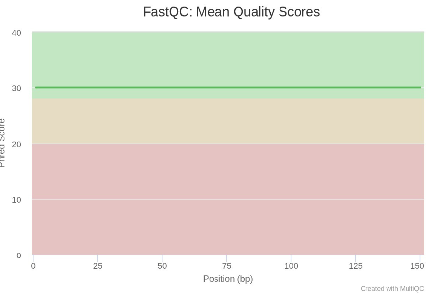
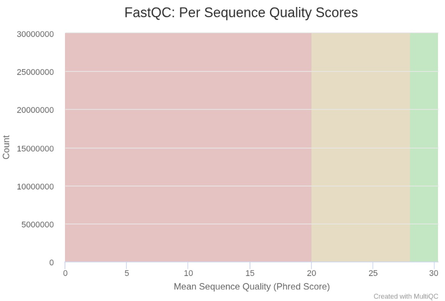
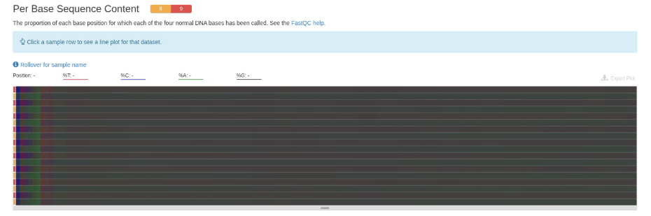
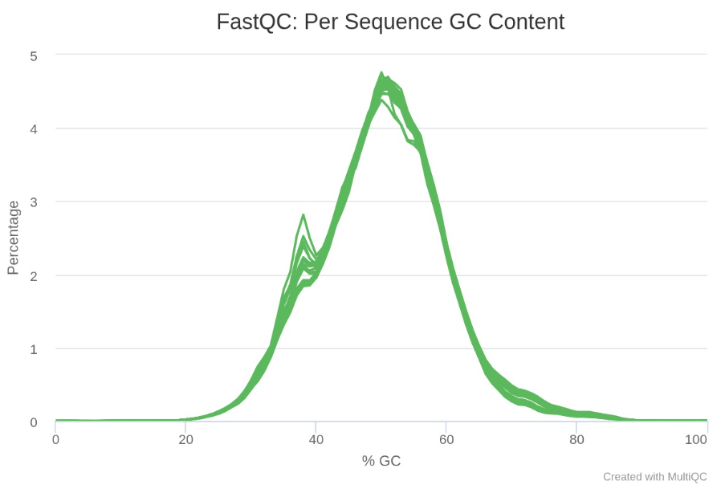
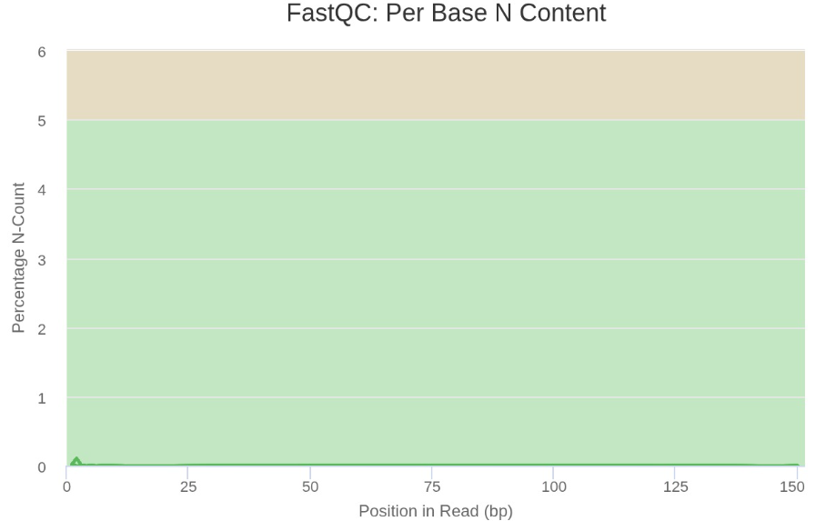
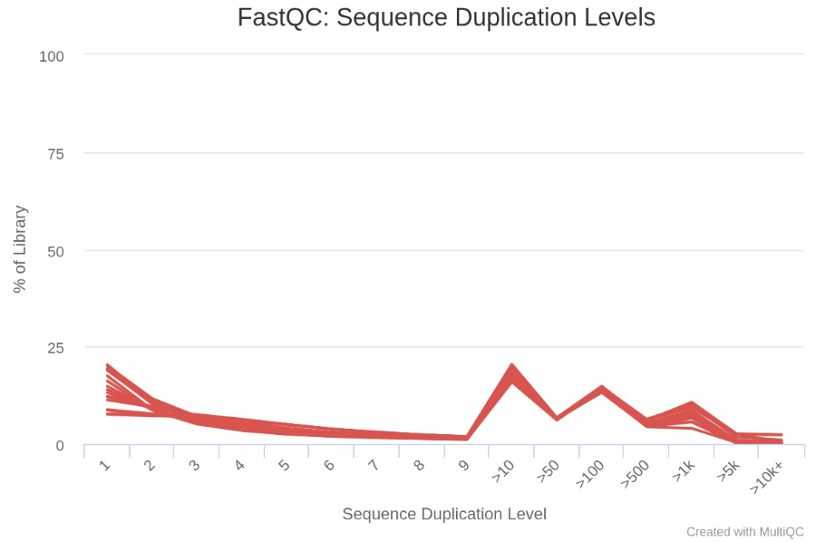
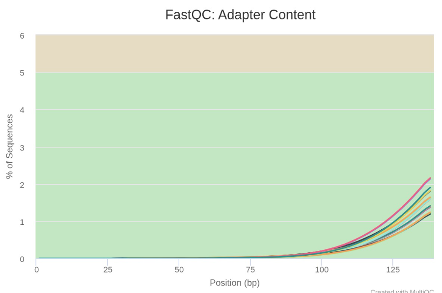
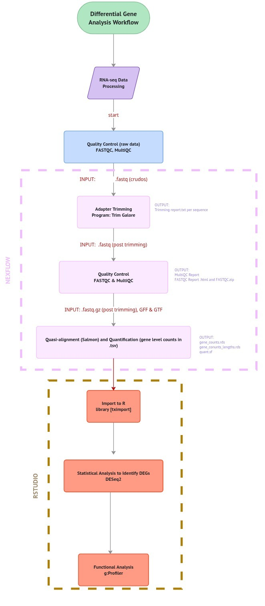
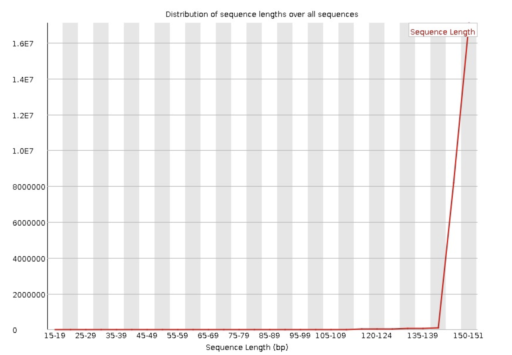

**Bioinformática y estadística 2**

Fecha de entrega: 20 de Mayo del 2025

### Elaborado por:

-⁠ ⁠Equipo: 3

-⁠ ⁠Integrantes:

• Diana Barrientos González (dbarrientos): [diana.barrientos.glz\@gmail.com](mailto:diana.barrientos.glz@gmail.com){.email}

• Román Cervantes Levario (rcervantes): [ro.cerlev\@gmail.com](mailto:ro.cerlev@gmail.com){.email}

• Jair Emiliano Contreras Rivera (jcontreras): [jairivera322\@gmail.com](mailto:jairivera322@gmail.com){.email}

## Descripción de los datos

**Título del artículo original:** Impact of spaceflight and artificial gravity on sulfur metabolism in mouse liver: sulfur metabolomic and transcriptomic analysis

**Elaborado por:** Ryo Kurosawa, Ryota Sugimoto, Hiroe Imai, Kohei Atsuji, Koji Yamada, Yusuke Kawano, Iwao Ohtsu, Kengo Suzuki

**Publicado el:** 8 de Noviembre del 2021

[Tabla 1: Detalles del Bioproyecto y características de las muestras]{style="color: gray;"}

```{r}
library(DT)
tabla_info <- data.frame(
  Descripcion = c(
    "Bioproject",
    "Especie",
    "Tipo de bibliotecas",
    "Método de selección",
    "Número de transcriptomas",
    "Número de réplicas biológicas",
    "Secuenciador empleado",
    "Profundidad de secuenciación de cada transcriptoma",
    "Tamaño de las lecturas",
    "Artículo científico"
  ),
  
  Informacion = c(
    '<a href="https://www.ncbi.nlm.nih.gov/bioproject/PRJNA1005192" target="_blank">PRJNA1005192</a>',
    "Mus musculus",
    "paired-end",
    "Poly(A) mRNA Magnetic Isolation Module",
    "9",
    "3 réplicas biológicas para 3 condiciones",
    "Illumina NovaSeq 6000",
    "14.4 M seq a 25.9 M seq",
    "300 AvgSpotLen",
    "Kurosawa R, Sugimoto R, Imai H, Atsuji K, Yamada K, Kawano Y, Ohtsu I, Suzuki K. Impact of spaceflight and artificial gravity on sulfur metabolism in mouse liver: sulfur metabolomic and transcriptomic analysis. Sci Rep. 2021 Nov 8;11(1):21786. doi: 10.1038/s41598-021-01129-1. PMID: 34750416; PMCID: PMC8575787"
  ),
  
  stringsAsFactors = FALSE
)

datatable(
  tabla_info,
  rownames = FALSE,
  escape = FALSE,
  options = list(
    pageLength = 10,
    searching = FALSE,
    paging = FALSE,
    dom = 't'
  )
)
```

El artículo de "Impact of spaceflight and artificial gravity on sulfur metabolism in mouse liver: sulfur metabolomic and transcriptomic analysis (house mouse)" analiza el daño hepático por vuelos espaciales, debido al estrés oxidativo causado por el entorno espacial. El organismo modelo *Mus musculus*, del strain C57BL/6J fue utilizado bajo tres condiciones:

-   La primera a bordo de la estación espacial internacional (MG mice)

-   La segunda sometidos a gravedad terrestre artificial (A1G mice)

-   Comparados con un grupo de control de ratones en la Tierra (GC mice)

Se usó RNA-seq para estudiar la *upregulation* de un conjunto de genes relacionados al estrés oxidativo y el metabolismo del azufre.

Para fines de esta práctica, se seleccionaron las muestras correspondientes las tres condiciones, las cuales se presentan en la Tabla 2.

[Tabla 2: Distribución de las muestras y réplicas biológicas]{style="color: gray;"}

```{r, echo = FALSE}

tabla3 <- data.frame(
  biosample = c(36978221, 36978220, 36978219,
                36978218, 36978217, 36978216,
                36978215, 36978214, 36978213),
  
  grupo = c("GC mice", "GC mice", "GC mice",
            "A1G mice", "A1G mice", "A1G mice",
            "MG mice", "MG mice", "MG mice"),
  
  condicion = c("Control en la Tierra", "Control en la Tierra", "Control en la Tierra",
                "Gravedad terrestre artificial", "Gravedad terrestre artificial", "Gravedad terrestre artificial",
                "Microgravedad en el espacio", "Microgravedad en el espacio", "Microgravedad en el espacio"),
  
  sample_ID = c("SAMN36978221_GC", "SAMN36978220_GC", "SAMN36978219_GC",
                "SAMN36978218_A1G", "SAMN36978217_A1G", "SAMN36978216_A1G",
                "SAMN36978215_MG", "SAMN36978214_MG", "SAMN36978213_MG"),
  
  srr_ID = c("SRR25629473", "SRR25629472", "SRR25629471",
             "SRR25629470", "SRR25629469", "SRR25629468",
             "SRR25629467", "SRR25629466", "SRR25629465")
)

datatable(
  tabla3,
  rownames = FALSE,
  colnames = c("ID réplica biológica", "Grupo", "Condición", "BioSample", "SRR ID"), # cambia nombres
  options = list(
    pageLength = 6,   # cuántas filas mostrar
    lengthMenu = c(5, 10, 15),
    searching = TRUE, # buscador
    paging = TRUE
  ),
)
```

## Abstract y resumen de nuestro trabajo

Para este análisis de RNA-seq, se utilizaron datos de un estudio que compara transcriptomas hepáticos de ratones bajo tres condiciones diferentes: ratones expuestos a gravedad artificial en la Tierra, ratones sometidos a microgravedad en el espacio durante 30 días y un control de ratones en la Tierra.

Se analizaron datos transcriptómicos de RNA-seq obtenidos del BioProject PRJNA1005192 con nueve transcriptomas de hígado paired-end enriquecidas para mRNA Poly(A), secuenciadas con Illumina NovaSeq 6000. Cada condición contó con tres réplicas biológicas y una profundidad de secuenciación de entre 14.4 y 25.9 millones de lecturas, con longitud promedio de 300 pb. Nuestro análisis permitió explorar cambios en la expresión génica relacionados con la adaptación fisiológica hepática frente a condiciones de microgravedad y gravedad artificial.

## Descripción de nuestras rutas

**Buenas prácticas de bioinformática**

Las carpetas siguen la siguiente estructura:

**Equipo3/** (`/mnt/data/bioinfo-estadistica-2/RNAseq_2026/equipos/Equipo3`): Directorio de trabajo principal donde se encuentra el proyecto.

-   **data/** (`/mnt/data/bioinfo-estadistica-2/RNAseq_2026/equipos/Equipo3/data`): En esta carpeta se encuentran los datos de las secuencias de RNA e información relacionada.

    -   **raw/** (`/mnt/data/bioinfo-estadistica-2/RNAseq_2026/equipos/Equipo3/data/raw`): En esta carpeta se guardaron las secuencias crudas extraídas de [ENA](https://www.ebi.ac.uk/ena/browser/view/PRJNA1005192) usando el ID del bioproject.

    -   **metadata.txt**: Es un archivo de texto que contiene la información de la tabla 2.

    -   **txi_salmon.RData**: Este archivo es un documento intermedio para importar los datos a R.

-   **quality1/** (`/mnt/data/bioinfo-estadistica-2/RNAseq_2026/equipos/Equipo3/quality1`): Dentro de este directorio podemos encontrar los controles de calidad de las secuencias crudas.

    -   **fastqc/** (`/mnt/data/bioinfo-estadistica-2/RNAseq_2026/equipos/Equipo3/quality1/fastqc`): Esta carpeta incluye los resultados de los controles de calidad para las secuencias individuales.

        -   **html/** (`/mnt/data/bioinfo-estadistica-2/RNAseq_2026/equipos/Equipo3/quality1/fastqc/html)`: Engloba al reporte de los controles de calidad en formato `html`.

        -   **fastqc_info/** (`/mnt/data/bioinfo-estadistica-2/RNAseq_2026/equipos/Equipo3/quality1/fastqc/fastqc_info`): Dentro de esta carpeta podemos encontrar información comprimida de los reportes de calidad.

    -   **multiqc/** (`/mnt/data/bioinfo-estadistica-2/RNAseq_2026/equipos/Equipo3/quality1/multiqc`): Este directorio contiene la información resumida de los reportes de calidad de todas las secuencias crudas.

        -   **multiqc_report.html**: En este archivo .html se encuentra el reporte de multiqc para todas las secuencias crudas.

        -   **multiqc_data/** (`/mnt/data/bioinfo-estadistica-2/RNAseq_2026/equipos/Equipo3/quality1/multiqc/multiqc_data`): Dentro de esta carpeta se encuentra información relacionada de los multiqc.

-   **quality2/** (`/mnt/data/bioinfo-estadistica-2/RNAseq_2026/equipos/Equipo3/quality2`): En esta carpeta podemos ver todos los outputs del control de calidad (trimming) y pseudoalineamiento (Salmon), que arrojó Nextflow. El funcionamiento del pipeline se explicará más adelante.

    -   **fastqc/** (`/mnt/data/bioinfo-estadistica-2/RNAseq_2026/equipos/Equipo3/quality2/fastqc`): En esta carpeta se encuentra el control de calidad antes de hacer el trimming. Este reporte es idéntico al de **quality1/**, sin embargo no se eliminó para mantener la estructura del pipeline original.

    -   **multiqc_trim/** (`/mnt/data/bioinfo-estadistica-2/RNAseq_2026/equipos/Equipo3/quality2/multiqc_trim`): Esta carpeta el reporte de las secuencias posterior a hacer el trimming. Dentro de esta se encuentra el archivo `.html` con el reporte y una carpeta con información de las estadísticas calculadas

    -   **pipeline_info/** (`/mnt/data/bioinfo-estadistica-2/RNAseq_2026/equipos/Equipo3/quality2/pipeline_info`): Dentro de este directorio podemos encontrar información del pipeline ejecutado. Estos datos nos aseguran reproducibilidad y nos aseguran de que todo de corrió correctamente. Entre los procesos que podemos apreciar dentro de este se encuentran:

        -   **software_versions.yml**: Información de las versiones del software y programas utilizados

        -   **params\_\*.json**: Qué parámetros fueron utilizados para el pipeline

        -   **execution_timeline_2026-XXX-XX-XX_XX.html**: Es una línea temporal sobre cuáles y cuántos procesos fueron ejecutados así como su duración

        -   **execution_trace_2026-XXX-XX-XX_XX.txt**: Información sobre los procesos ejecutados

        -   **execution_report_XXXX-XX-XX_XX.html**: Contiene un resumen de la corrida del pipeline

    -   **trimgalore/** (`/mnt/data/bioinfo-estadistica-2/RNAseq_2026/equipos/Equipo3/quality2/trimgalore`): En esta carpeta podemos observar el reporte del trimming de las secuencias así como los fastqc post trimming de las secuencias.

        -   **SAMPLE_X.fastq.gz_trimming_report.txt**: Estos archivos son reportes del trimming de cada secuencia. Este nos reporta el total de reads originales, reads en las que se encontraron adaptadores, bases removidas por mala calidad, reads conservadas y el total de bases restantes posterior al trimming.

        -   **fastqc/** (`/mnt/data/bioinfo-estadistica-2/RNAseq_2026/equipos/Equipo3/quality2/trimgalore/fastqc`): Contiene el reporte de las secuencias posterior al trimming. Esta carpeta es el input de **multiqc_trim/**

    -   **work/** (`/mnt/data/bioinfo-estadistica-2/RNAseq_2026/equipos/Equipo3/quality2/work`): Dentro de esta carpeta se guardan todos los archivos ejecutados durante el pipeline. Dentro de esta podemos encontrar las secuencias post trimming. Podemos encontrar sus rutas con el comando `find . -name "val.fq.gz"`

    -   **salmon/** (`/mnt/data/bioinfo-estadistica-2/RNAseq_2026/equipos/Equipo3/quality2/salmon`): Este directorio engloba todo los outputs del pseudoalinemiento con Salmon. Nos dice la cuantificación de transcritos, abundancia, etc.

        -   **SAMPLE_CONDITION/**: Estas carpetas contienen los resultados del pseudoalineamiento y conteo para una muestra. Cada muestra contiene una carpeta con su propio resultado del pseudoalinemiento. Cada una contiene:

            -   **quant.sf**: Cuantificación y abundancia a nivel del transcrito

            -   **quant.genes.sf**: Cuantificación y abundancia a nivel del gen

            -   **aux_info/**: Contiene estadísticas y modelos usados por Salmon. El archivo más importante dentro de esta carpeta es meta_info.json el cual contiene los metadatos del pipeline (reads procesados, versión de Salmon, etc.)

            -   Las carpetas restantes engloban información sobre el comando para correr Salmon (**cmd_info.json**), orientación de la librería (**lib_format_counts.json**), distribución de librerías mencionadas previamente (**libParams/**), además de warnings, errores y tiempos dentro de la carpeta (**logs/**)

        -   **salmon.merged.gene_counts.tsv**: Este .tsv contiene el conteo de genes para todas las muestras.

        -   **salmon.merged.gene_tpm.tsv**: Es una matriz con los transcritos por millón para todas las muestras.

        -   **salmon.merged.transcript_counts.tsv**: Es un formato alterno que contiene los conteos de cada trascrito para todas las muestras

        -   **salmon.merged.gene_lengths.tsv**: Contiene la longitud de los genes para todas las muestras

        -   **salmon.merged.transcript_lengths.tsv**: Contiene la longitud de los transcritos para todas las muestras

        -   **tx2gene.tsv**: Muestra la relación entre transcritos y gen

Se analizó la calidad de las secuencias en los datos crudos, obteniendo un contenido de GC en un rango de 48 - 50% , con una distribución normal y una profundidad de lectura en un rango de 14.4 M a 25.9 M secuencias.

Las muestras presentan una calidad óptima, con valores dentro de la zona verde y un puntaje Phred de 30 en todas las muestras.

::: {style="display: flex; gap: 10px; align-items: flex-start;"}
 
:::

Calidad de las secuencias en muestras GC, A1G y MG mice

En la gráfica "Per Sequence Quality Scores", la calidad está en 30 para todas las lecturas. Esto es lo esperado debido a que el secuenciador Illumina NovaSeq 6000 tiene una calidad muy alta.

::: {style="display: flex; gap: 10px; align-items: flex-start;"}

:::

Proporción de cada base por posición

Esta gráfica está dentro de lo esperado para un experimento de RNA seq, se observa homogeneidad a lo largo de la gráfica, excepto al inicio, lo cual es lo esperado debido al ruido biológico.

::: {style="display: flex; gap: 10px; align-items: flex-start;"}

:::

Variaciones en el porcentaje de %GC en todas las muestras

En el mRNA de ratón, el contenido de GC esperado debería estar cercano a 50%, debido a que estamos capturando exones y genes expresados, lo cual puede aumentar la proporción esperada. Eso mismo es lo que observamos en la gráfica, donde el pico más alto está cercano a 50%.

::: {style="display: flex; gap: 10px; align-items: flex-start;"}

:::

Contenido de N por base

El secuenciador identificó correctamente las bases en todas las posiciones de la secuenciación, por lo cual no hay ninguna posición donde la secuencia sea desconocida.

Distribución de la longitud de secuencias: todas las muestras tienen una longitud de 150 bp, lo cual es lo esperado considerando que son paired-end. En total con ambas lecturas, obtendríamos la longitud de 300 bp.

::: {style="display: flex; gap: 10px; align-items: flex-start;"}
 
:::

### Calidad de las secuencias en las muestras
l
El contenido de adaptadores es adecuado ya que no sube a más del 2%.

Por otro lado, aunque se observan varios picos en la distribución de los niveles de duplicados, el hecho de que todas las características estén bien, además del diseño del experimento, es decir, RNA seq de hígado de ratón separado por PolyA, sugiere que puede ser una señal real de expresión en lugar de un problema, sin embargo se tomará en cuenta para análisis posteriores.

## Conclusión

Los indicadores de MultiQC muestran una alta calidad, por lo cual los datos son adecuados para continuar con el procesamiento y análisis posterior. Las secuencias tienen una buena calidad en general, con calidad de secuencia de 30 en el Phred score y un contenido de %GC adecuado, además de que los nucleótidos no mapeados son prácticamente nulos. Aunque se observa picos en los niveles de secuencias duplicadas, el diseño del experimento sugiere que es normal (polyA y sobreexpresión en hígado).

## Diagrama de flujo



## Explicación de inputs y outputs

### Inputs

Se utilizó nextflow para tener control sobre el flujo del trabajo. Este nos permite automatizar y guardar los procedimientos en caso de que el trabajo se detenga. Para realizar la corrección con este programa tenemos que especificar distintos parámetros:

-   Se necesita especificar la ruta de los outputs, uso de memoria, computadoras e inputs

-   Para eliminar los adaptadores, decidimos usar Trimgalore: Este programa realiza la tarea de forma eficiente además de recortar secuencias de mala calidad

-   Dado el tamaño y la cantidad de nuestras muestras, un alineamiento iba a ser muy costoso computacionalmente, por lo que se decidió hacer un pseudoalineamiento utilizando Salmon, un programa con buen desempeño y que adicionalmente tiene un programa de corrección de sesgos de GC

-   Para alinear, especificamos que se buscara el genoma de referencia predefinida para el genoma del ratón

-   Algunas opciones incluidas para evitar errores fueron fijar Java 11 en el entorno de Nextflow y fijar una versión del pipeline de nf-core compatible con Java 11 (algunas requerían versiones superiores que no estaban disponibles)

```{bash}
#| eval: false
#!/bin/bash #SBATCH --job-name=rnaseq_equipo3 #SBATCH --output=/mnt/data/bioinfo-estadistica-2/RNAseq_2026/equipos/Equipo3/scripts/out_logs/rnaseq_%j.out #SBATCH --error=/mnt/data/bioinfo-estadistica-2/RNAseq_2026/equipos/Equipo3/scripts/out_logs/rnaseq_%j.err #SBATCH --time=24:00:00 #SBATCH --cpus-per-task=2 #SBATCH --mem=8G

export JAVA_HOME=/usr/lib/jvm/java-11-openjdk-11.0.25.0.9-7.el9.x86_64 export PATH=$JAVA_HOME/bin:$PATH

module load nextflow/23.04.1 module load singularity/3.7.0


nextflow run nf-core/rnaseq \
    -revision 3.14.0 \
    -profile singularity \
    --input /mnt/data/bioinfo-estadistica-2/RNAseq_2026/equipos/Equipo3/scripts/samplesheet.csv \
    --outdir /mnt/data/bioinfo-estadistica-2/RNAseq_2026/equipos/Equipo3/quality2 \
    --genome GRCm38 \
    --pseudo_aligner salmon \
    --skip_alignment \
    --trimmer trimgalore \
    --extra_salmon_quant_args '--gcBias true' \
    -resume
```

Refiriendo al documento de input, se tiene que crear un documento csv que contenga la información de la ruta de las secuencias para cada muestra. Así como especificar la orientación de la transcirpción, en nuestro caso lo fijamos a automático.

```{bash}
#| eval: false
sample,fastq_1,fastq_2,strandedness
SAMN36978221_GC,/mnt/data/bioinfo-estadistica-2/RNAseq_2026/equipos/Equipo3/data/raw/SRR25629473_1.fastq.gz,/mnt/data/bioinfo-estadistica-2/RNAseq_2026/equipos/Equipo3/data/raw/SRR25629473_2.fastq.gz,auto
SAMN36978220_GC,/mnt/data/bioinfo-estadistica-2/RNAseq_2026/equipos/Equipo3/data/raw/SRR25629472_1.fastq.gz,/mnt/data/bioinfo-estadistica-2/RNAseq_2026/equipos/Equipo3/data/raw/SRR25629472_2.fastq.gz,auto
SAMN36978219_GC,/mnt/data/bioinfo-estadistica-2/RNAseq_2026/equipos/Equipo3/data/raw/SRR25629471_1.fastq.gz,/mnt/data/bioinfo-estadistica-2/RNAseq_2026/equipos/Equipo3/data/raw/SRR25629471_2.fastq.gz,auto
SAMN36978218_A1G,/mnt/data/bioinfo-estadistica-2/RNAseq_2026/equipos/Equipo3/data/raw/SRR25629470_1.fastq.gz,/mnt/data/bioinfo-estadistica-2/RNAseq_2026/equipos/Equipo3/data/raw/SRR25629470_2.fastq.gz,auto
SAMN36978217_A1G,/mnt/data/bioinfo-estadistica-2/RNAseq_2026/equipos/Equipo3/data/raw/SRR25629469_1.fastq.gz,/mnt/data/bioinfo-estadistica-2/RNAseq_2026/equipos/Equipo3/data/raw/SRR25629469_2.fastq.gz,auto
SAMN36978216_A1G,/mnt/data/bioinfo-estadistica-2/RNAseq_2026/equipos/Equipo3/data/raw/SRR25629468_1.fastq.gz,/mnt/data/bioinfo-estadistica-2/RNAseq_2026/equipos/Equipo3/data/raw/SRR25629468_2.fastq.gz,auto
SAMN36978215_MG,/mnt/data/bioinfo-estadistica-2/RNAseq_2026/equipos/Equipo3/data/raw/SRR25629467_1.fastq.gz,/mnt/data/bioinfo-estadistica-2/RNAseq_2026/equipos/Equipo3/data/raw/SRR25629467_2.fastq.gz,auto
SAMN36978214_MG,/mnt/data/bioinfo-estadistica-2/RNAseq_2026/equipos/Equipo3/data/raw/SRR25629466_1.fastq.gz,/mnt/data/bioinfo-estadistica-2/RNAseq_2026/equipos/Equipo3/data/raw/SRR25629466_2.fastq.gz,auto
SAMN36978213_MG,/mnt/data/bioinfo-estadistica-2/RNAseq_2026/equipos/Equipo3/data/raw/SRR25629465_1.fastq.gz,/mnt/data/bioinfo-estadistica-2/RNAseq_2026/equipos/Equipo3/data/raw/SRR25629465_2.fastq.gz,auto
```

### Outputs

Los dos principales outputs de este pipeline son:

-   Las lecturas ya limpias de Trimgalore

-   Una matriz que indica el conteo de genes por cada muestra y otras adicionales con el conteo por muestra individual

## MultiQC posterior a la limpieza

En general, la calidad de las secuencias se mantuvo. el contenido de %GC es similar en todas las muestras, manteniendo el rango entre 48-50%. De igual manera, el Phred Score es de 30 en toda la secuencia.

```{r, out.width="50%", fig.show="hold", echo = FALSE}
knitr::include_graphics('/Users/romaan/Desktop/Captura de pantalla 2026-04-28 a la(s) 11.41.51 a.m..png')
```

El único problema que podría haber es con el pico que se observa en el contenido de GC por secuencia. Mientras el promedio está cerca de 50%, se observa otro pico cerca de 37-38% de GC. Sin embargo, esta contaminación no debería preocuparnos tanto, ya que al momento de hacer el alineamiento del ratón, las secuencias que no correspondan (de la contaminación) no se alinearán.

```{r, out.width="50%", fig.show="hold", echo = FALSE}
knitr::include_graphics('/Users/romaan/Desktop/Captura de pantalla 2026-04-28 a la(s) 11.40.04 a.m..png')
```

Podemos observar que la gráfica de los niveles de secuencias duplicadas también se mantuvieron.

```{r, out.width="50%", fig.show="hold", echo = FALSE}
knitr::include_graphics('/Users/romaan/Desktop/Captura de pantalla 2026-04-28 a la(s) 11.41.21 a.m..png')
```

Por otro lado, el reporte muestra que se eliminaron correctamente los adaptadores, ya que no se encontraron muestras con contaminación de adaptadores ni con secuencias sobrerrepresentadas.

```{r, out.width="50%", fig.show="hold", echo = FALSE}
knitr::include_graphics('/Users/romaan/Desktop/Captura de pantalla 2026-04-28 a la(s) 11.44.57 a.m..png')
```

**Tamaño del read inicial (datos crudos) y final (datos procesados)**

Los datos crudos tenían un tamaño de 300 bp.

Los reads procesados sin adaptadores tienen longitudes más variadas, desde 40-300 bp, aunque la distribución de los tamaños se concentra mucho más hacia 300 bp:



## Importación de datos en R

Se realizó el siguiente script para la importación de los datos:

```{bash}
#| eval: false
.libPaths(c("~/R/libs", .libPaths()))

# Paquetes
library(tximport)
library(DESeq2)
# Definimos la ruta
ruta <- "/mnt/data/bioinfo-estadistica-2/RNAseq_2026/equipos/Equipo3/quality2/salmon"
metadata <- read.csv("/mnt/data/bioinfo-estadistica-2/RNAseq_2026/equipos/Equipo3/data/metadata.csv", header = TRUE)
metadata$folder_name <- metadata$sample_ID

# Buscamos los quant.sf 
archivos_sf <- file.path(ruta, metadata$folder_name, "quant.sf")

# Extraemos el nombre SRR de la ruta
nombres_srr <- basename(dirname(archivos_sf))
names(archivos_sf) <- nombres_srr
archivos_sf

# Importamos con tximport 
tx2gene <- read.table(
  "/mnt/data/bioinfo-estadistica-2/RNAseq_2026/equipos/Equipo3/quality2/salmon/tx2gene.tsv",
  header = TRUE,
  sep    = "\t"
)
head(tx2gene)
dim(tx2gene)

txi.salmon <- tximport(
  archivos_sf,
  type           = "salmon",
  tx2gene        = tx2gene,
  ignoreTxVersion = TRUE,
  ignoreAfterBar  = TRUE
)

# Verificamos
names(txi.salmon)

# Imprimimos
all_genes <- rownames(txi.salmon$abundance)
length(unique(all_genes))
```

A partir de esto se obtuvo un total de 44677 transcritos.

Dimensión del dataset: 109616 3

## Referencias

1)  Blaber, E. et al. (2017). Spaceflight Activates Autophagy Programs and the Proteasome in Mouse Liver. International Journal of Molecular Sciences

2)  Mhatre, S. et al. (2022). Artificial Gravity Partially Protects Space-induced Neurological Deficits in Drosophila melanogaster. Cell Reports

3)  Kurosawa R, Sugimoto R, Imai H, Atsuji K, Yamada K, Kawano Y, Ohtsu I, Suzuki K. Impact of spaceflight and artificial gravity on sulfur metabolism in mouse liver: sulfur metabolomic and transcriptomic\>

4)  Vinken M. Hepatology in space: Effects of spaceflight and simulated microgravity on the liver. Liver Int. 2022 Dec;42(12):2599-2606. doi: 10.1111/liv.15444. Epub 2022 Oct 12. PMID: 36183343.
